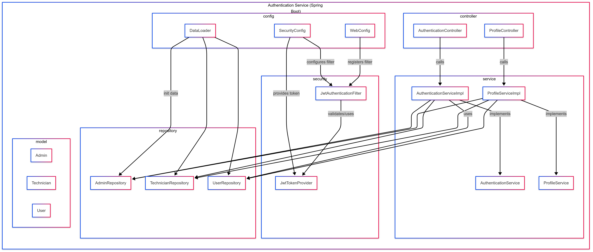
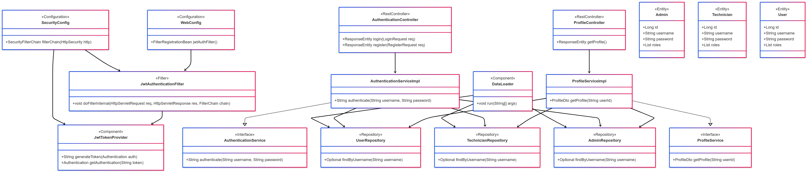

# PerbaikiinAja - Authentication

This project provides authentication services for users, technicians, and administrators. It handles account creation, login, and profile management. Users can register and manage their profiles, while technicians have additional attributes such as experience and job statistics. Administrators can create technician accounts. All secure endpoints require a valid JWT token.

## Architecture Diagrams

### Component Diagram

This diagram shows the high-level structure of the authentication service: how configuration, controllers, services, repositories, and models interact.



### Code Diagram

This diagram illustrates the internal class structure of the authentication module. It includes interfaces, implementations, and their relationships.



## API Reference

### Authentication Endpoints

#### Login

```http
POST /auth/login
```

**Description:**  
Authenticates a user, technician, or admin using email and password and returns a JWT token.

**Request Body:**

| Field    | Type     | Description                         |
| :------- | :------- | :---------------------------------- |
| email    | string   | **Required**. Email address.        |
| password | string   | **Required**. Password.             |

**Example:**

```json
{
  "email": "user@example.com",
  "password": "password"
}
```

---

#### Register User

```http
POST /auth/register/user
```

**Description:**  
Registers a new user account. A default profile photo is automatically assigned.

**Request Body:**

| Field       | Type     | Description                                  |
| :---------- | :------- | :------------------------------------------- |
| fullName    | string   | **Required**. Full name of the user.         |
| email       | string   | **Required**. Email address.                 |
| phoneNumber | string   | **Required**. Phone number.                  |
| password    | string   | **Required**. User password.                 |
| address     | string   | **Required**. User address.                  |

**Example:**

```json
{
  "fullName": "John Doe",
  "email": "john@example.com",
  "phoneNumber": "+123456789",
  "password": "password",
  "address": "123 Main St"
}
```

---

#### Register Technician

```http
POST /auth/register/technician
```

**Description:**  
Registers a new technician account (accessible only to admins). A default profile photo is automatically assigned.

**Request Body:**

| Field       | Type     | Description                                    |
| :---------- | :------- | :--------------------------------------------- |
| fullName    | string   | **Required**. Full name of the technician.     |
| email       | string   | **Required**. Email address.                   |
| phoneNumber | string   | **Required**. Phone number.                    |
| password    | string   | **Required**. Technician password.             |
| experience  | number   | **Optional**. Years of experience.             |
| address     | string   | **Required**. Technician address.              |

**Example:**

```json
{
  "fullName": "Tech One",
  "email": "tech@example.com",
  "phoneNumber": "1112223333",
  "password": "techpass",
  "experience": 3,
  "address": "Tech Address"
}
```

---

### Profile Endpoints

> **Note:** All profile endpoints require a valid JWT token in the `Authorization` header:
>
> `Authorization: Bearer <jwt-token>`

#### Get Profile

```http
GET /profile
```

**Description:**  
Retrieves the profile information of the authenticated user or technician.

**Parameters:**

| Parameter | Type   | Description                           |
| :-------- | :----- | :------------------------------------ |
| None      |        | Authentication token required.      |

**Example Response (User):**

```json
{
  "id": "00000000-0000-0000-0000-000000000003",
  "fullName": "John Doe",
  "email": "john@example.com",
  "phoneNumber": "+123456789",
  "address": "123 Main St",
  "profilePhoto": "default-user.png"
}
```

**Example Response (Technician):**

```json
{
  "id": "00000000-0000-0000-0000-000000000004",
  "fullName": "Tech One",
  "email": "tech@example.com",
  "phoneNumber": "1112223333",
  "address": "Tech Address",
  "experience": 3,
  "totalJobsCompleted": 0,
  "totalEarnings": 0.0,
  "profilePhoto": "default-technician.png"
}
```

---

#### Update Profile

```http
PUT /profile
```

**Description:**  
Updates the profile information of the authenticated user or technician. Fields that can be updated include fullName, phoneNumber, address, profilePhoto, and password. For technicians, the `experience` field is also updatable.

**Request Body:**

| Field        | Type     | Description                                             |
| :----------- | :------- | :------------------------------------------------------ |
| fullName     | string   | **Optional**. Updated full name.                        |
| phoneNumber  | string   | **Optional**. Updated phone number.                     |
| address      | string   | **Optional**. Updated address.                          |
| profilePhoto | string   | **Optional**. Updated profile photo (URL or file name).   |
| password     | string   | **Optional**. New password (will be hashed).            |
| experience   | number   | **Optional (Technician only)**. Updated experience value.|

**Example (Technician):**

```json
{
  "fullName": "Updated Tech",
  "phoneNumber": "9998887777",
  "address": "Updated Tech Address",
  "profilePhoto": "updated-tech.png",
  "password": "newTechPassword",
  "experience": 7
}
```

**Example (User):**

```json
{
  "fullName": "Updated User",
  "phoneNumber": "+1112223333",
  "address": "Updated Address",
  "profilePhoto": "updated-user.png",
  "password": "newPassword"
}
```

**Example Response (Technician):**

```json
{
  "id": "00000000-0000-0000-0000-000000000004",
  "fullName": "Updated Tech",
  "email": "tech@example.com",
  "phoneNumber": "9998887777",
  "address": "Updated Tech Address",
  "experience": 7,
  "totalJobsCompleted": 0,
  "totalEarnings": 0.0,
  "profilePhoto": "updated-tech.png"
}
```

## Environment Configuration

Before running the application, create a `.env` file in the project root with the following example settings. Replace these dummy values with your actual configuration as needed.

```dotenv
# Database
DATABASE_URL=jdbc:postgresql://localhost:5432/perbaikiinaja
DATABASE_USERNAME=your_db_username
DATABASE_PASSWORD=your_db_password

# JWT
# Make sure the raw (decoded) key is at least 512 bits (64 bytes) in length.
JWT_SECRET="your_jwt_secret_key"
```
